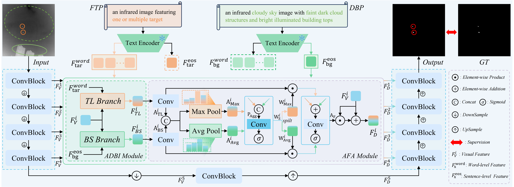
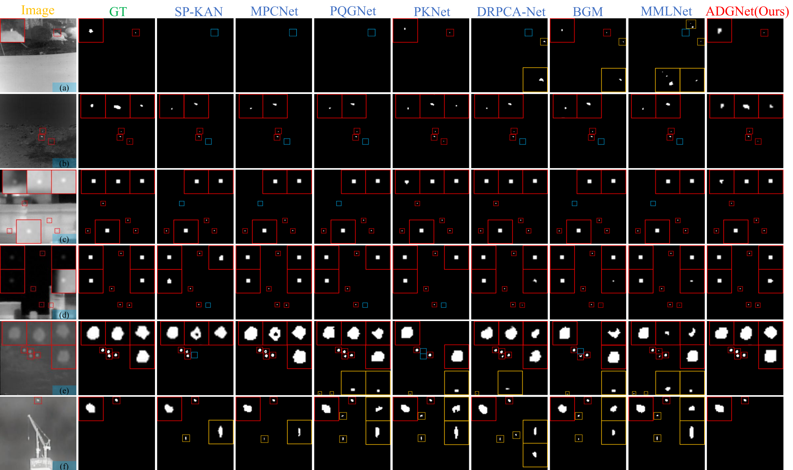

<div align="center">
<h2 align="center">
    <b>(ACM MM-2026) ADGNet: Asymmetric Dual-text Guided Network for Infrared Small Target Detection</b>
</h2>
<div>
Tongtong&#160;Wang<sup>1</sup>,
Mingzhu&#160;Xu<sup>1&#9993;</sup>,
Chenglong&#160;Yu<sup>1</sup>,
Jing&#160;Wang<sup>1</sup>,
Xiaohui&#160;Lin<sup>1</sup>,
Weili&#160;Guan<sup>2</sup>
</div>
<sup>1</sup>School of Software, Shandong University&#160;&#160;&#160;
<sup>2</sup>Harbin Institute of Technology, Shenzhen
<br />
<sup>&#9993;&#160;</sup>Corresponding author
<br />
<div align="center">
    <a href="" target="_blank">
        
    </a>
    <a href="https://huggingface.co/datasets/iLearn-Lab/MM26-ADGNet-AITIR-Text" target="_blank">
        
    </a>
    <a href="https://huggingface.co/iLearn-Lab/MM26-ADGNet" target="_blank">
        
    </a>
    <a href="https://github.com/iLearn-Lab/MM26-ADGNet" target="_blank">
        
    </a>
</div>
</div>


## 📢 Updates

- 🤗 **[08/2026]** Model **checkpoints** of the SOTA methods and **text data** are released on **Hugging Face**.
- 💻 **[08/2026]** **Source code** is now publicly available.
- 🎉 **[07/2026]** Our paper was accepted by **ACM Multimedia 2026 (ACM MM 2026)**.

## 📖 Introduction

This repository provides the official implementation of **ADGNet: Asymmetric Dual-text Guided Network for Infrared Small Target Detection**, accepted by **ACM Multimedia 2026 (ACM MM 2026)**.

Infrared Small Target Detection (IRSTD) aims to accurately segment weak and tiny targets from complex infrared backgrounds. Existing pure-vision methods rely solely on pixel-level information and often struggle to distinguish small targets from background clutter. Meanwhile, existing vision-language methods typically describe targets and backgrounds using a single textual prompt, overlooking their inherent semantic asymmetry and introducing feature optimization conflicts.

To address these limitations, we propose **ADGNet**, an **Asymmetric Dual-text Guided Network** for infrared small target detection. Its main components include:

- **Asymmetric Dual-text Prompt (ADP):** employs an abstract, image-independent target prompt and a detailed, image-dependent background prompt to provide dedicated semantic guidance.
- **Asymmetric Dual-Branch Interaction (ADBI):** separately constructs a Target Localization branch and a Background Suppression branch to enhance weak targets and suppress complex clutter.
- **Adaptive Feature Aggregation (AFA):** dynamically integrates the features produced by the two branches to achieve accurate target segmentation.

We also construct the **Asymmetric Image-Text Infrared (AITIR)** dataset by providing asymmetric text annotations for three widely used infrared small target datasets: **IRSTD-1K**, **NUDT-SIRST**, and **SIRST**. Extensive experiments demonstrate that ADGNet achieves competitive performance against 21 state-of-the-art methods.

This repository provides:

- 💻 Training and inference code for ADGNet
- 🏆 Model checkpoints of the SOTA methods
- 📝 AITIR asymmetric text annotations
- 📊 Evaluation scripts

## 🧠 Method / Framework

<p align="center">
  
</p>

<p align="center">
  <b>Figure 1. Overall architecture of ADGNet.</b>
</p>

---

## 📁 Project Structure

```python
ADGNet
├── Figs/        # Overall framework of ADGNet
├── datasets/
│   ├── IRSTD-1K/
│   │   ├── images/                    # Original infrared images
│   │   ├── masks/                     # Ground-truth masks
│   │   ├── img_idx/                   # Training and testing splits
│   │   └── text/                      # Target and background prompts
│   ├── NUDT-SIRST/ 
│   └── SIRST/
├── model/
│   ├── ADGNet.py                      # Main ADGNet architecture
│   ├── TL_Branch.py                   # Target Localization branch
│   ├── BS_Branch.py                   # Background Suppression branch
│   └── DualStreamFusion.py            # Dual-branch interaction and AFA
│
├── dataset.py                         # Dataset loader and augmentation
├── train.py                           # Training, testing, and inference
├── net.py                             # Network and loss wrapper
├── loss.py                            # SoftIoU loss
├── metrics.py                         # IoU, Pd, and Fa evaluation metrics
├── roc.py                             # ROC and AUC evaluation
├── params.py                          # FLOPs, parameters, and FPS analysis
├── utils.py                           # Data processing and training utilities
├── requirements.txt                   # Python dependencies
├── README.md
└── LICENSE
```

## ⚙️ Installation

### 📥 1. Clone the Repository

```python
git clone https://github.com/iLearn-Lab/MM26-ADGNet.git
cd MM26-ADGNet
```

### 🧪 2. Create the Environment

```python
conda create -n ADGNet python=3.10 -y
conda activate ADGNet
```

### 🤗 3. Download the CLIP Weights

ADGNet uses the pretrained **CLIP ViT-B/16** model. You can download the model weights from either **Hugging Face** or **ModelScope**.

```python
sudo apt update
sudo apt install git-lfs
git lfs install
# Option A: Download from Hugging Face
git clone https://huggingface.co/openai/clip-vit-base-patch16
# Option B: Download from ModelScope
git clone https://www.modelscope.cn/openai-mirror/clip-vit-base-patch16.git
```

### 📦 4. Install Project Dependencies

```python
pip install torch==2.1.0 torchvision==0.16.0 torchaudio==2.1.0 --index-url https://download.pytorch.org/whl/cu121
pip install -r requirements.txt
```

## 🏆 Checkpoints / Models

We provide the trained checkpoints of **ADGNet** on three infrared small target detection datasets.

|  Dataset   | IoU (%) ↑ | Pd (%) ↑ | Fa (10⁻⁶) ↓ |                          Checkpoint                          |
| :--------: | :-------: | :------: | :---------: | :----------------------------------------------------------: |
|  IRSTD-1K  |   72.38   |  93.20   |    4.10     | [`Download`](https://huggingface.co/iLearn-Lab/MM26-ADGNet/blob/main/ADGNet_mIoU_72.38_IRSTD-1K.pth.tar) |
| NUDT-SIRST |   95.53   |  99.47   |    2.64     | [`Download`](https://huggingface.co/iLearn-Lab/MM26-ADGNet/blob/main/ADGNet_mIoU_95.53_NUDT-SIRST.pth.tar) |
|   SIRST    |   83.08   |  100.00  |    4.97     | [`Download`](https://huggingface.co/iLearn-Lab/MM26-ADGNet/blob/main/ADGNet_mIoU_83.08_SIRST.pth.tar) |

## 📝 Text Annotations

We release the asymmetric text annotations used to construct the **AITIR** dataset.

<table>
  <thead>
    <tr>
      <th>Dataset</th>
      <th>Text Annotations</th>
      <th>Download</th>
    </tr>
  </thead>
  <tbody>
    <tr>
      <td>IRSTD-1K</td>
      <td rowspan="3">Fixed Target Prompt + Detailed Background Prompt</td>
      <td rowspan="3"><a href="https://huggingface.co/datasets/iLearn-Lab/MM26-ADGNet-AITIR-Text/tree/main">Download</a></td>
    </tr>
    <tr>
      <td>NUDT-SIRST</td>
    </tr>
    <tr>
      <td>SIRST</td>
    </tr>
  </tbody>
</table>

## 🚀 Usage

### 🏋️ Training

Train ADGNet on the selected dataset:

```python
python train.py \
    --trainset "IRSTD-1K" \
    --testset "IRSTD-1K" \
    --dataset_dir "./datasets" \
    --epochs 600 \
    --batchSize 16 \
    --num_workers 8 \
    --mode train
```

> Replace `IRSTD-1K` with `NUDT-SIRST` or `SIRST` when training on another dataset.

### 🔍 Evaluation and Inference

Evaluate a trained checkpoint and generate prediction maps:

```python
python train.py \
    --trainset "IRSTD-1K" \
    --testset "IRSTD-1K" \
    --dataset_dir "./datasets" \
    --mode test \
    --ckpt "./SOTA_pth/ADGNet_mIoU_72.38_IRSTD-1K.pth.tar"
```

## 🖼️ Visualization

The following figure presents qualitative comparisons between **ADGNet** and representative SOTA infrared small target detection methods on **IRSTD-1K**, **NUDT-SIRST**, and **SIRST**.

<p align="center">
  
</p>

<p align="center">
  <b>Figure 2. Qualitative comparisons of different methods on the IRSTD-1K, NUDT-SIRST, and SIRST datasets.</b>
</p>

## 📚 Citation

If you find this project useful in your research, please consider citing our paper:

```bibtex
@inproceedings{wang2026adgnet,
  title     = {ADGNet: Asymmetric Dual-text Guided Network for Infrared Small Target Detection},
  author    = {Wang, Tongtong and Xu, Mingzhu and Yu, Chenglong and Wang, Jing and Lin, Xiaohui and Guan, Weili},
  booktitle = {Proceedings of the ACM International Conference on Multimedia},
  year      = {2026},
}
```

Please also consider checking out and citing our other related work:

```bibtex
@inproceedings{yu2026dgnet,
  title     = {DGNet: Dual-knowledge Guided Network for Infrared Small Target Detection},
  author    = {Yu, Chenglong and Xu, Mingzhu and Wang, Jing and Wang, Tongtong and Miao, Pingping and Nie, Liqiang},
  booktitle = {Proceedings of the ACM International Conference on Multimedia},
  year      = {2026},
}
```

## 🛠️ IRSTD-AutoLabel

In addition, we have open-sourced an automated annotation tool for infrared small target detection, **IRSTD-AutoLabel**. Interested readers are encouraged to visit the project page for more details and usage instructions:

> Project:：[iLearn-Lab/IRSTD-AutoLabel](https://github.com/iLearn-Lab/IRSTD-AutoLabel)

## 📄 License

This project is released under the [Apache License 2.0](./LICENSE).

You may use, modify, and distribute the code in accordance with the terms of the license. Please retain the original license and attribution notices in redistributed or modified versions.

**如有问题，欢迎联系:** wangtongtong@163.com **或** wangttong@mail.sdu.edu.cn
